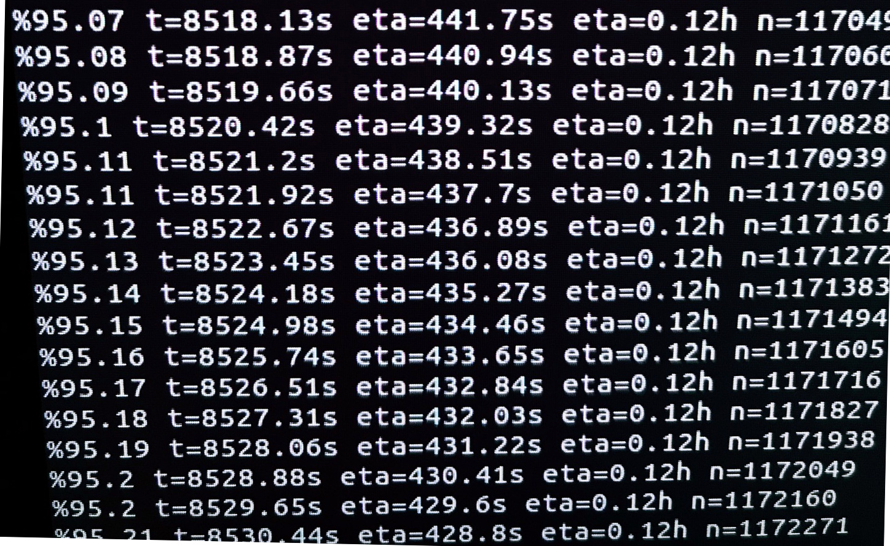

# bcstats ohcs craigslist
Extractor / parser, written for web-scraped craigslist data as provided to BC Stats, by Harmari Inc.

** coming soon: R-interface!**

Use HPC techniques to wrangle a large, irregular housing-market dataset on an ordinary laptop, in a finite amount of time

* out of memory
* parallelism

The data include an irregularly formatted CSV file (22GB) incl. approx. 1 million HTML files stuffed into the CSV, where each HTML-file attribute, spans approx. 500 lines. Python 3's "import csv" and R's "library{vroom}" weren't able to read the data at this time, so custom out-of-memory slicing was developed. Moreover, Python3's BeautifulSoup html-parsing, was applied and accelerated using full machine-parallelism

The data contain sensitive information and will not be posted, however the project documentation will be included when approved

## Process analytics
Sample visualization of process monitor for one of the steps in this "big-data" application

## License

Copyright 2020 Province of British Columbia

Licensed under the Apache License, Version 2.0 (the "License");
you may not use this file except in compliance with the License.
You may obtain a copy of the License at

   http://www.apache.org/licenses/LICENSE-2.0

Unless required by applicable law or agreed to in writing, software
distributed under the License is distributed on an "AS IS" BASIS,
WITHOUT WARRANTIES OR CONDITIONS OF ANY KIND, either express or implied.
See the License for the specific language governing permissions and limitations under the License.
